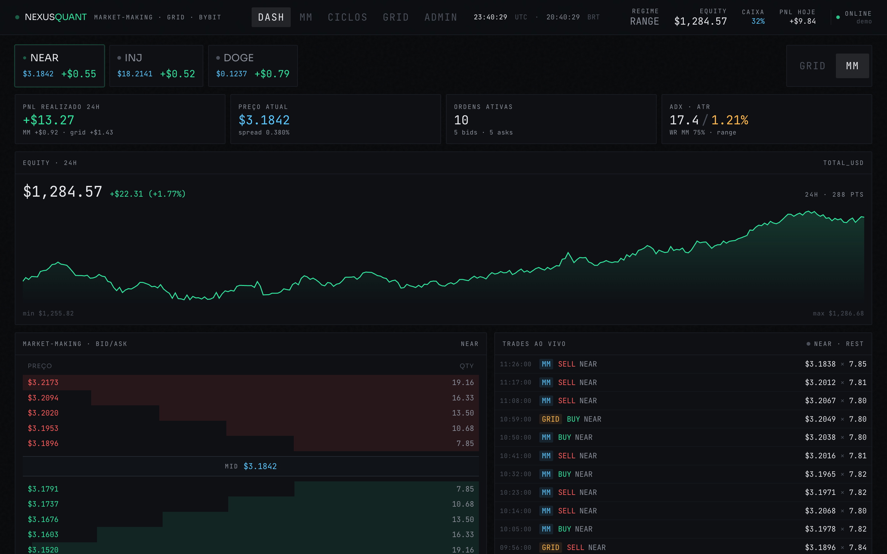
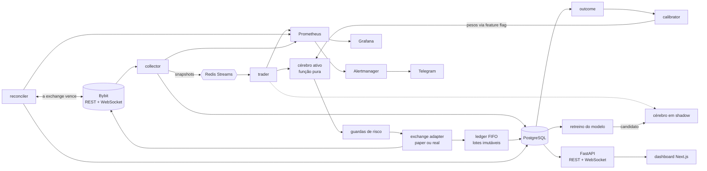
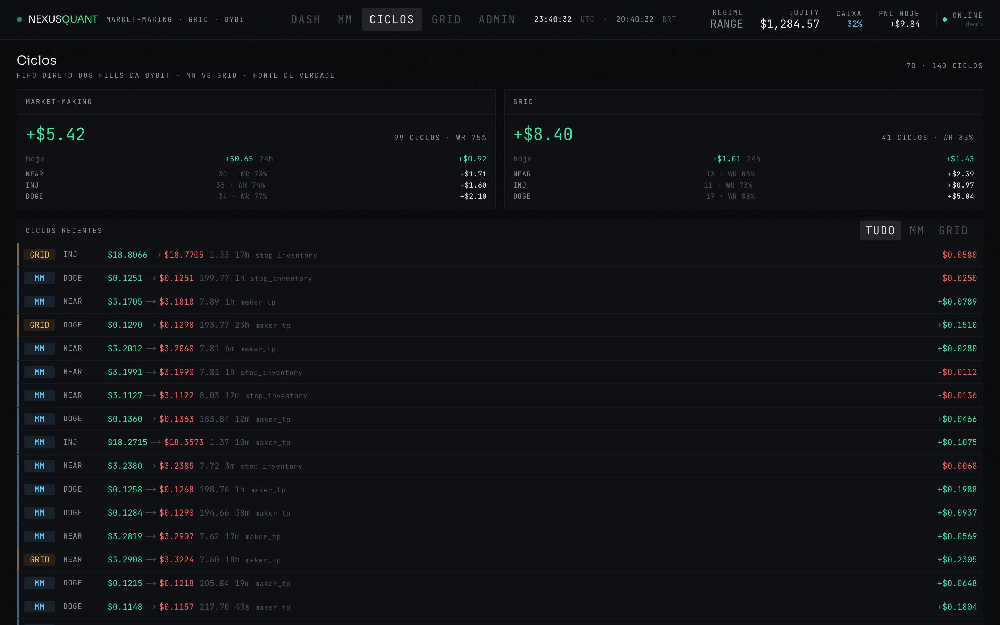

# Nexus Quant

Bot de trading de criptomoedas (Bybit spot) que construí sozinho entre março e setembro de 2026: grid trading com um "cérebro" de decisão trocável em produção, pipeline de machine learning com validação temporal purgada, reconciliação contínua com a exchange e observabilidade de ponta a ponta.

Este repositório é só a vitrine. **O código e a estratégia são privados**; aqui está como o sistema foi pensado, o que foi medido e o que deu errado.

Print gerado com dados fictícios. Pares, valores e limiares não são os reais.

---

## O problema

Grid trading parece simples: espalhar ordens de compra abaixo do preço, e cada compra executada vira uma venda um pouco acima. Na prática, três coisas quebram o modelo:

1. **Estado.** O banco local, a carteira e o livro de ordens da exchange divergem. Na primeira versão a divergência chegava a 12–26% das ordens e criava "ordens fantasma" a cada restart.
2. **Quando não operar.** Grid ganha com oscilação e perde em queda prolongada. A pergunta que importa não é "onde comprar", é "em que regime de mercado vale a pena estar ligado".
3. **Fricção.** Cada ciclo paga taxa na entrada e na saída. Com margem pequena por ciclo, a taxa decide o resultado. Esse terceiro ponto acabou sendo o mais importante do projeto (ver [O que aprendi](#o-que-aprendi)).

## O que o sistema faz

- Coleta preço e indicadores da Bybit (via ccxt) e publica cada snapshot em Redis Streams.
- Um worker de trading consome o stream, pede uma decisão ao cérebro ativo, passa a decisão pelos guardas de risco e envia a ordem.
- Toda compra executada vira um **lote FIFO imutável**. Toda venda nasce de um lote específico e nunca abaixo do custo daquele lote mais a taxa de ida e volta.
- Um reconciliador compara a exchange com o banco a cada minuto. A exchange sempre vence.
- Um loop de retroalimentação mede, depois do fato, o que aconteceu com o preço após cada decisão e recalibra os pesos dos sinais.
- Um segundo cérebro pode rodar em **shadow mode**, decidindo em paralelo sem operar, até provar concordância suficiente para ser promovido sem restart.
- Dashboard em Next.js com o terminal ao vivo; métricas em Prometheus, painéis no Grafana e alertas no Telegram.

## Arquitetura

O núcleo segue arquitetura hexagonal: `core/` é domínio puro, sem IO (modelos Pydantic imutáveis, cérebros, ledger FIFO, risco, grid, testes estatísticos de regime); `adapters/` implementa banco, exchange, cache, mensageria e notificação; `services/` orquestra; `workers/` são os processos de longa duração.

### Cérebro trocável

O cérebro é um `Protocol` com um único método: recebe o contexto de mercado e devolve uma decisão. Sem IO, sem estado, sem efeito colateral. Isso trouxe três coisas:

- **Teste trivial.** Cada cérebro é testado como função pura, com contexto montado à mão.
- **Hot-swap.** Um registro de cérebros e uma feature flag no banco escolhem o cérebro ativo; o resolver relê a flag com TTL curto e o próximo tick já usa o novo, sem derrubar nada.
- **Shadow mode.** O candidato decide em paralelo, a divergência vira métrica, e um script só promove quando a concordância nas últimas centenas de decisões passa de um piso definido antes.

O projeto teve cinco gerações de cérebro: regras empíricas pontuadas (v10), modelo de gradient boosting (v11/v12), meta-classificador calibrado e uma versão final (v13) baseada em regime e regras de exclusão.

### Princípios que vieram da dor da v9

1. **A exchange é a fonte de verdade.** O banco local é cache. Se divergir, a exchange vence.
2. **FIFO por lote, nunca preço médio.** Preço médio escondia vendas no prejuízo.
3. **Idempotência.** Todo `client_order_id` é determinístico; um restart nunca duplica ordem.
4. **Eventos imutáveis.** Decisões, trades e outcomes são append-only.
5. **Guardas com estado são por par.** Um contador global de compras em cascata deixou um par resetar o limite de outro. Depois disso, nenhum estado de risco é global.
6. **Implementado não é ativado.** Toda mudança de risco confere código, configuração e feature flag.

## Machine learning e pesquisa

O trabalho de ML foi feito com a preocupação de não se enganar, que em finanças é o problema principal.

**Features.** Três famílias: indicadores do snapshot (momento, força de tendência, volatilidade normalizada, amplitude em várias janelas, z-scores), sinais binários das regras empíricas da v10, e features "para trás" (drawdown, arrancada e velocidade do preço em janelas curtas), além de contexto de calendário e do movimento do BTC. A extração em runtime é testada para bater exatamente a ordem e a semântica do treino, porque um desalinhamento ali quebra a predição sem erro visível.

**Rótulo.** O resultado real de cada decisão, medido depois do fato em vários horizontes pelo worker de outcome. O mesmo dado alimenta a recalibração online dos pesos (média móvel exponencial com passo assimétrico e teto).

**Modelos.** LightGBM para classificar oportunidades de entrada; regressão logística com calibração isotônica como meta-classificador, para transformar score em probabilidade utilizável como confiança.

**Validação.**
- Walk-forward com **purga e embargo** (López de Prado, *Advances in Financial Machine Learning*, cap. 7): o intervalo entre treino e teste cobre o horizonte do rótulo, para não vazar o futuro.
- Métricas de probabilidade (AUC, Brier, log-loss), não só acerto.
- Limiar de decisão tirado da curva resultado-vs-limiar no hold-out, nunca chutado.
- Promoção exige bater o modelo atual **e** uma baseline trivial no mesmo hold-out.
- **PBO** (probabilidade de overfitting do backtest, via CSCV) para testar se a configuração vencedora sobrevive fora da amostra. Duas ideias promissoras foram derrubadas assim antes de ir para produção.

**Regime de mercado.** Classificador estatístico que combina half-life de reversão, expoente de Hurst, teste de razão de variância e ADF, por voto de concordância. Na prática o que mais pesou foi uma classificação de regime mais simples, por retorno recente, decidindo se o grid fica ligado.

**Backtest.** Simulador sobre candles de 1 minuto, com saída por lote, taxa e slippage por execução. Antes do simulador "canônico" houve implementações que discordavam entre si; achar a causa (uma média invertida, um cooldown aplicado no lugar errado) virou teste de regressão.

Print gerado com dados fictícios.

## Gestão de risco

Em camadas, cada uma testada isoladamente:

- **Regra de ouro da venda:** nenhuma venda abaixo do custo do lote mais a taxa de ida e volta, garantida na única função que cria vendas.
- **Stop-loss por lote**, com teto de perda diária, e **time-stop** para lotes que ficam abertos tempo demais (a pesquisa mostrou que a taxa de acerto despenca com o tempo de posição).
- **Limite de compras em cascata** por par, **exposição máxima** por moeda e **piso de caixa** em USDT.
- **Pausa total** em regime de baixa forte e porta de confiança mínima para comprar.
- **Circuit breaker** por drawdown diário e **kill switch** acessível pela API e por script na VM.
- **Detecção de poeira** (saldos abaixo do mínimo da exchange), depois que um resíduo minúsculo entrou em loop de rejeição.

## Engenharia

| | |
|---|---|
| Linguagem e stack | Python 3.12, FastAPI, SQLAlchemy 2.0 async, Pydantic v2, PostgreSQL 16, Redis 7 (Streams + pub/sub), ccxt, LightGBM, scikit-learn, Next.js 15, Tailwind, TanStack Query |
| Testes | **1.060 testes passando** em ~45 s na última execução (suíte unitária de 1.063; as 3 falhas restantes são de ambiente na lib de JWT), mais testes de integração com Postgres e Redis reais |
| Qualidade | ruff e mypy em modo estrito no CI, cobertura mínima como gate, pre-commit |
| CI/CD | GitHub Actions: lint, tipos, testes e integração; build da imagem; deploy na VM com verificação do SHA em `/health` depois de subir |
| Infra | Docker Compose em VM no GCP; Terraform para a variante Cloud Run + Cloud SQL + Memorystore; Alembic para migrações |
| Observabilidade | Métricas Prometheus (ordens, bloqueios por guarda, decisões por cérebro, latência de decisão, divergência do shadow, heartbeat de cada worker), 4 painéis Grafana provisionados, alertas no Telegram, logs estruturados em JSON |

Uma lição de deploy que virou regra: durante um dia inteiro a VM rodou código antigo porque o passo de SSH do pipeline falhava em silêncio. Desde então todo deploy só termina quando o SHA servido em `/health` bate com o commit.

## Evolução: v9 → v1

| | v9 (protótipo) | v1 (reescrita) |
|---|---|---|
| Período | mar–abr/2026 | abr–set/2026 |
| Commits | 625 | 359 |
| Testes automatizados | nenhum | 1.060+ |
| Python | ~21 mil linhas, monólito assíncrono | ~31 mil linhas de código e ~18 mil de testes, hexagonal |
| Estado | SQLite, saldo local como verdade | PostgreSQL + Redis, exchange como verdade |
| Decisão | scanner de moedas com score ponderado | cérebro plugável, shadow mode, ML com validação purgada |
| Contabilidade | preço médio | FIFO por lote |
| Deploy | PM2 via SSH | containers, CI com gates, Terraform |

A v9 rodou em dry run com milhares de trades em poucos dias e provou que o grid funcionava mecanicamente. Também mostrou tudo o que não escalava: estado divergente, ordens fantasma, nenhuma forma de testar uma ideia nova sem arriscar a que estava rodando. A v1 foi escrita do zero para resolver isso.

## O que aprendi

**As taxas decidiram o resultado.** Medindo FIFO sobre as execuções reais, cerca de 96% do lucro bruto virou taxa: a estratégia empatava com o mercado e perdia na corretagem. A mesma conclusão já aparecia num relatório interno meses antes, e o projeto seguiu otimizando sinal em vez de atacar a fricção. Foi a lição mais cara: descobrir não adianta se a descoberta não muda a próxima decisão.

**ML não achou sinal onde não havia.** O LightGBM ficou com AUC entre 0,55 e 0,61 fora da amostra, pouco acima do acaso. Três regras de exclusão simples empataram com o modelo. Mantive o pipeline (ele é o que permite dizer isso com segurança) e tirei o modelo do caminho crítico.

**Backtest otimista morre no dinheiro real.** Uma variante de market-making parecia excelente no backtest, que assumia execução na máxima e na mínima de cada candle. Em produção, a margem capturada ficou abaixo da taxa de ida e volta e, em tendência, o bot vendia justamente o ativo que subia. Desliguei o market-making com base na auditoria das execuções e documentei o critério para religar: prova nova de vantagem, não intuição.

**O que mais doeu nem sempre é o que parece.** Na auditoria, a perda vinha dos stop-losses do grid, não do market-making, que estava perto do zero a zero.

**Outras ideias descartadas por dados:** filtro por horário, trailing stop, reset dinâmico do grid, juros compostos, anti-martingale, saída em lote pelo preço médio, rotação dinâmica de pares, Kelly fracionado fixo, confirmação multi-timeframe e funding rate como filtro. O que sobreviveu foi pouco e simples: saída por lote, cooldown por volume negociado em vez de tempo, espaçamento ajustado à volatilidade, time-stop e não operar em queda forte.

**Nível de evidência importa.** No fim, classifiquei todo o acervo de pesquisa (cerca de 170 documentos) por nível de evidência: execução com dinheiro real, backtest reproduzível, backtest sem dados preservados, afirmação sem código. Vários resultados que pareciam sólidos no meio do projeto caíram para os níveis mais baixos, e os números de market-making foram refutados pela execução real.

## Código

O código, os dados e os parâmetros da estratégia são privados. Detalhes técnicos de arquitetura, testes ou do pipeline de ML: posso mostrar numa conversa, é só pedir.

---

Documentação sob [CC BY 4.0](LICENSE). Os prints usam dados fictícios.
